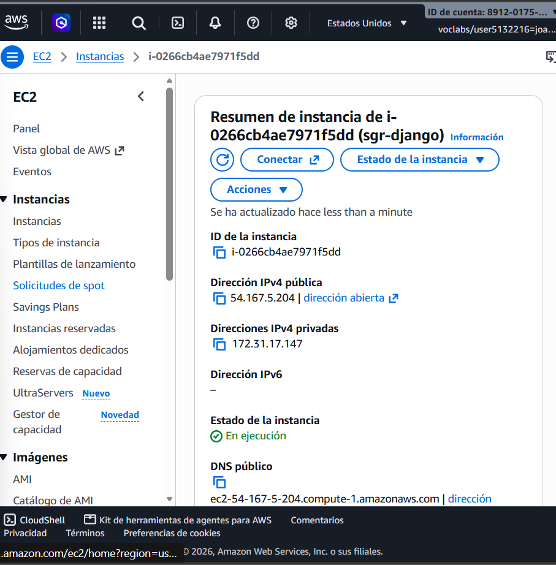
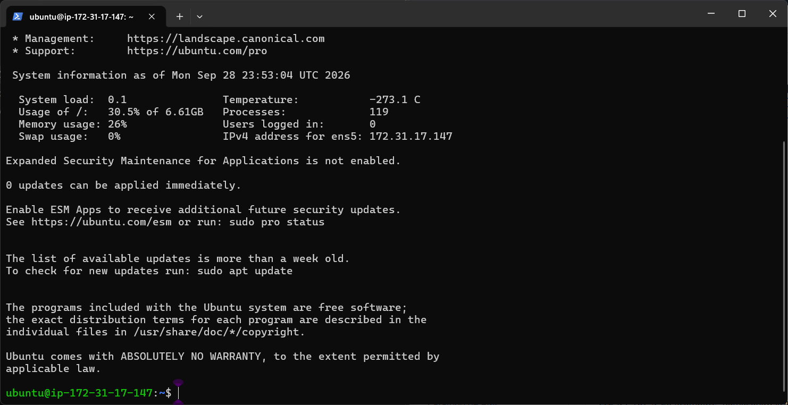
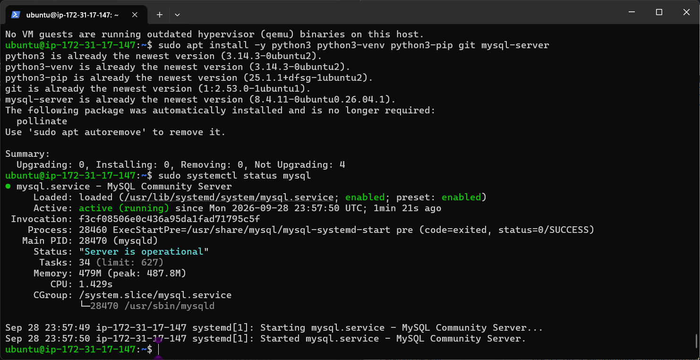
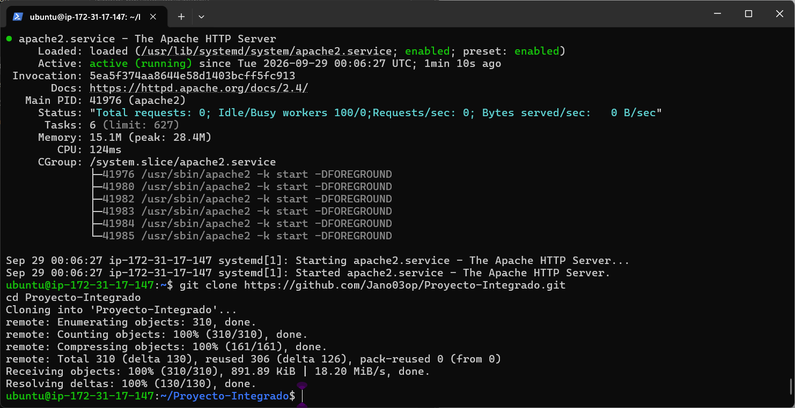
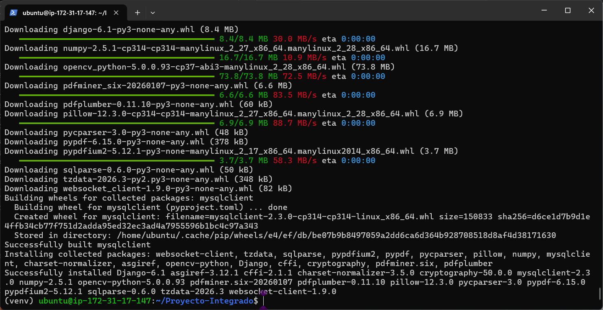
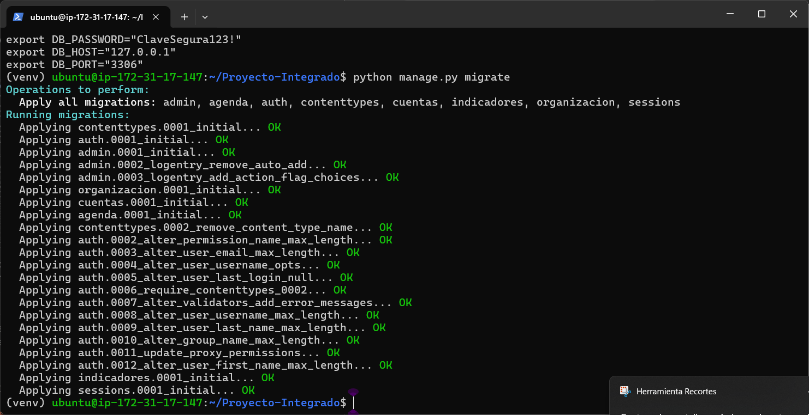
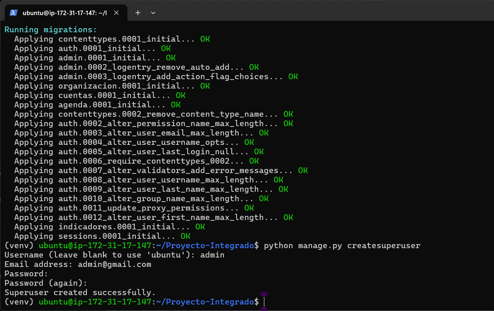
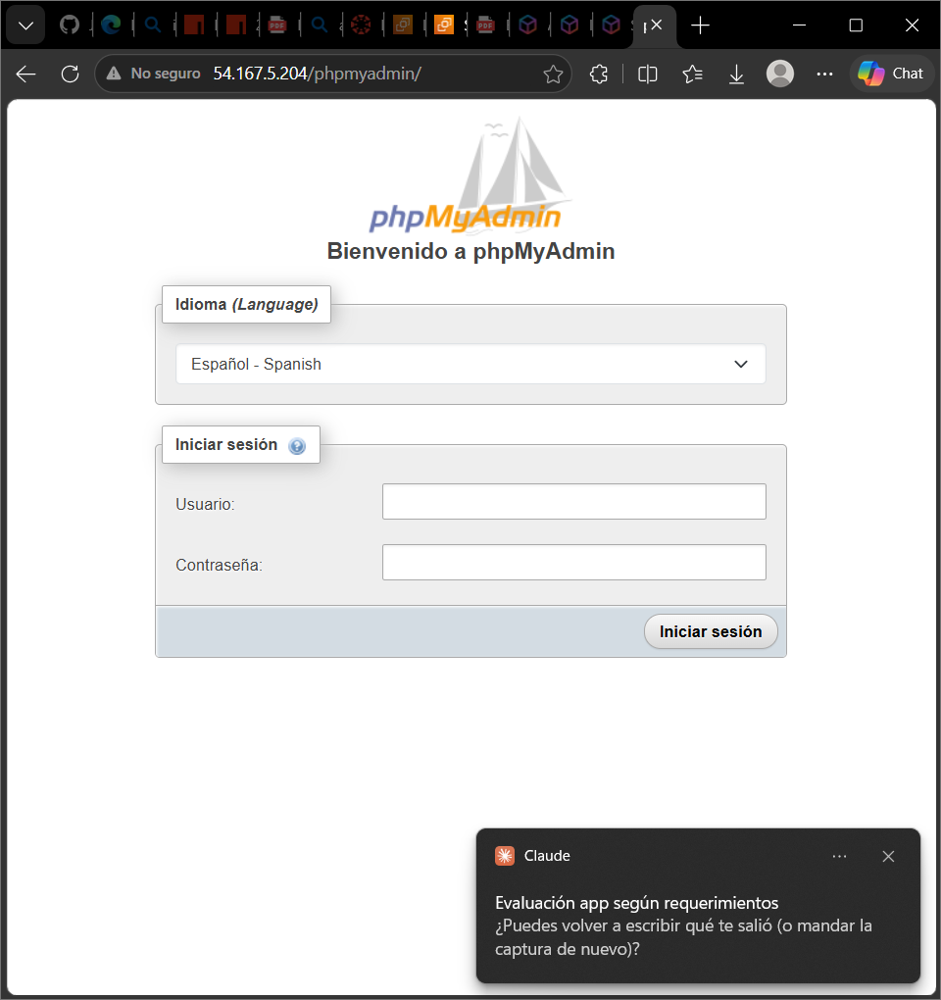
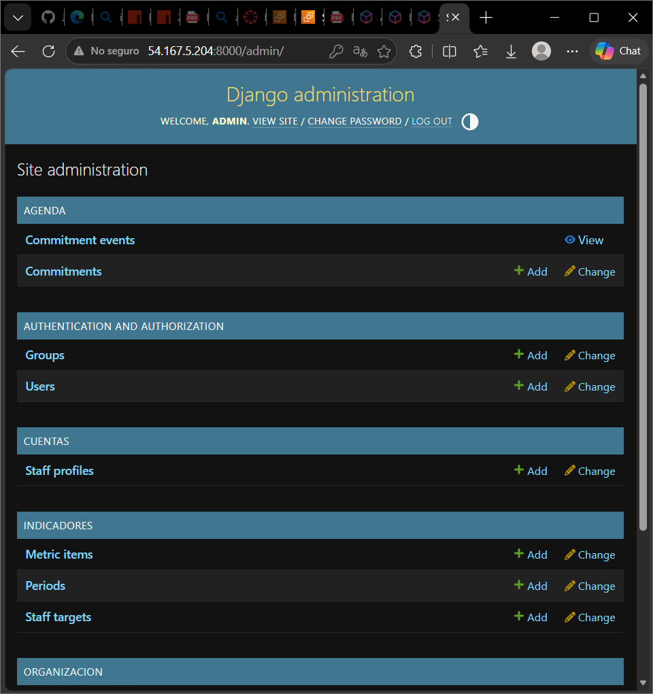

# Sistema de Gestión y Rendición (SGR)

**Evidencias — Evaluación Sumativa N°2**  
Programación Back End (TI3041) · Primavera 2026

> Este documento reúne dos partes: **Parte A** (evidencias del despliegue realizado) y
> **Parte B** (justificación arquitectónica y contraste con la arquitectura objetivo).

---

# Parte A — Evidencias del despliegue

## 1. Descripción del proyecto

### Objetivo

Evolucionar el prototipo de la Evaluación Sumativa N°1 (un sitio Django con datos en archivos JSON) hacia una aplicación web funcional, con persistencia en una base de datos relacional (MySQL), administración completa vía Django Admin, y desplegada en una instancia Amazon EC2 de AWS.

### Temática elegida

Sistema de Gestión y Rendición (SGR) para delegaciones municipales de la Ilustre Municipalidad de La Serena: registro de funcionarios, delegaciones territoriales, compromisos de la agenda colectiva ciudadana, y medición de metas/indicadores de gestión por período.

### Funcionalidades implementadas

- Modelos Django con relaciones y llaves foráneas para 9 entidades (Delegation, Position, StaffProfile, Period, MetricItem, StaffTarget, Commitment, CommitmentEvent, y el modelo de usuario de Django).
- Migraciones aplicadas contra una base de datos MySQL real, corriendo en la misma instancia EC2.
- Django Admin operativo para todas las entidades: creación, edición, eliminación, visualización y búsqueda de registros.
- Reglas de negocio a nivel de modelo: periodos que no se solapan, transiciones de estado controladas para los compromisos (con historial inmutable de eventos), suma de ponderadores validada, etc.
- Variables de entorno para toda la configuración sensible (SECRET_KEY, credenciales de base de datos) — nada de esto queda escrito en el código fuente.

## 2. Arquitectura

### Estructura de carpetas

El proyecto sigue la estructura estándar de Django, con una app por módulo funcional:

- config/ — settings, urls, wsgi/asgi del proyecto.
- cuentas/ — autenticación, perfiles de funcionarios (StaffProfile).
- organizacion/ — delegaciones territoriales y cargos (Delegation, Position).
- agenda/ — compromisos de la agenda colectiva y su historial (Commitment, CommitmentEvent).
- indicadores/ — periodos de medición, catálogo de métricas y metas (Period, MetricItem, StaffTarget).
- templates/ y static/ — plantillas HTML (Bootstrap) y archivos estáticos.

### Aplicaciones desarrolladas

Cuatro aplicaciones Django independientes (cuentas, organizacion, agenda, indicadores), integradas bajo un único proyecto (config), cada una con sus propios modelos, vistas, formularios y administración.

### Base de datos utilizada

MySQL 8.4 (Community Server), instalado y operativo directamente en la instancia EC2. La configuración de conexión (host, usuario, contraseña, nombre de la base) se inyecta mediante variables de entorno, nunca hardcodeada en settings.py.

## 3. Evidencia AWS

Instancia EC2 (Ubuntu Server) creada y en ejecución, con IP pública asignada:

*Instancia EC2 "sgr-django" en estado "En ejecución", IP pública 54.167.5.204.*

Conexión establecida por SSH desde la terminal local hacia la instancia:

*Sesión SSH activa: ubuntu@ip-172-31-17-147.*

Servidor de base de datos MySQL corriendo dentro de la propia instancia EC2:

*Servicio mysql.service activo ("Server is operational").*

## 4. Evidencia de Control de Versiones (Git y GitHub)

Clonación del proyecto desde el repositorio remoto de GitHub directamente hacia la instancia EC2, mediante el comando git clone:

*git clone https://github.com/Jano03op/Proyecto-Integrado.git ejecutado con éxito dentro de la instancia EC2.*

> **Pendiente:** agregar captura del repositorio en github.com (vista general) y del historial de commits (pestaña "Commits").

## 5. Evidencia de Base de Datos

Entorno virtual configurado e instalación de dependencias (incluyendo mysqlclient, compilado desde el código fuente en la propia instancia):

*pip install -r requirements.txt completado sin errores: Django, mysqlclient y el resto de dependencias instaladas.*

Migraciones de Django aplicadas contra la base de datos MySQL real (sgr_db), creando todas las tablas del modelo:

*python manage.py migrate — todas las migraciones (contenttypes, auth, admin, organizacion, cuentas, agenda, indicadores, sessions) aplicadas con "OK".*

Creación del superusuario administrador:

*python manage.py createsuperuser — "Superuser created successfully".*

## 6. Evidencia phpMyAdmin

phpMyAdmin instalado sobre Apache en la misma instancia EC2, accesible públicamente y con inicio de sesión exitoso contra la base de datos sgr_db:

*Pantalla de inicio de sesión de phpMyAdmin, accedida vía http://54.167.5.204/phpmyadmin/.*

> **Pendiente:** agregar captura del listado de tablas dentro de sgr_db (menú izquierdo expandido) y de al menos un registro almacenado, para evidenciar estructura y datos, tal como exige el instrumento.

## 7. Evidencia Django Admin

Panel de administración de Django operativo, con las nueve entidades del modelo agrupadas por app y accesibles para operaciones CRUD (Add / Change):

*Django Admin: módulos Agenda, Authentication and Authorization, Cuentas e Indicadores, todos administrables.*

## 8. Evidencia de uso de Inteligencia Artificial

Se utilizó Claude (Anthropic) como asistente durante todo el proceso de despliegue en AWS, en modalidad de guía paso a paso: el estudiante ejecutó cada comando en su propia terminal SSH, y la IA interpretó las salidas (incluyendo errores) para indicar el siguiente paso.

### Prompts representativos y cómo se aplicaron

- "Que sistema operativo me pide exactamente" / "Y que tal amazon linux" — la IA contrastó el requisito real del instrumento (solo exige "Linux", sin distribución específica) contra las ventajas prácticas de Ubuntu para este caso (phpMyAdmin instalable con un solo comando vs. instalación manual en Amazon Linux), lo que definió la elección final de Ubuntu Server.
- Captura de un error de pip ("Can not find valid pkg-config name... Specify MYSQLCLIENT_CFLAGS") — la IA diagnosticó que faltaban las librerías de desarrollo de MySQL y propuso instalar pkg-config, default-libmysqlclient-dev y build-essential antes de reintentar, resolviendo la compilación de mysqlclient.
- "Se me quedo pegado" (durante la instalación de mysqlclient) — la IA explicó la diferencia entre un paquete precompilado (.whl) y uno que se compila desde el código fuente (.tar.gz), evitando una interrupción innecesaria del proceso con Ctrl+C.
- "Necesito que no quede anidado que sea nuevo nomas" — ante una carpeta de proyecto clonada accidentalmente de forma anidada, la IA diagnosticó el bloqueo de Windows por archivo/carpeta en uso y resolvió copiando el contenido (incluyendo el historial .git) a una ubicación nueva, en vez de un movimiento directo que fallaba.

Todas las respuestas de la IA fueron aplicadas directamente por el estudiante en su propia sesión SSH/AWS; la IA no tuvo ni tiene acceso a las credenciales de AWS ni ejecutó comandos por sí misma dentro de la instancia.

## 9. Pendientes para completar el entregable

- Capturas del repositorio GitHub (vista general y pestaña de commits).
- Captura de phpMyAdmin mostrando el listado de tablas de sgr_db y al menos un registro almacenado, además de las relaciones (llaves foráneas) visibles en la estructura de una tabla.
- Verificar y evidenciar los botones visuales (Agregar/Modificar/Eliminar/Buscar) en las vistas de listado de cada módulo de la aplicación (no solo en Django Admin).
- Prueba de CRUD completo desde Django Admin (crear, editar y eliminar un registro), con capturas de antes/después.

---

# Parte B — Justificación arquitectónica

## SGR — Justificación Arquitectónica y Contraste de Entornos

**Estado: Documento de diseño y justificación para Evaluación 2 (Objetivo planificado, no implementado).**

Este documento formaliza las decisiones técnicas tomadas para el Sistema de Gestión de Requerimientos (SGR), contrastando el **entorno de laboratorio evaluativo** (AWS Academy Learner Lab) frente a la **arquitectura objetivo de producción institucional** para la Municipalidad de La Serena.

---

### 1. Matriz de Contraste: Laboratorio Académico vs. Producción Municipal

| Dimensión | Prototipo Académico (AWS Academy) | Arquitectura Objetivo (Producción Municipal) | Justificación de la Diferencia |
|---|---|---|---|
| **Infraestructura y Red** | Monolito en contenedor único sobre 1 instancia EC2 `t3.small` (VPC por defecto, IP pública única). | VPC con 3 capas (Pública, Privada y Aislada de Datos) distribuidas en múltiples Zonas de Disponibilidad (Multi-AZ). | El prototipo prioriza bajo costo y simplicidad de entrega; producción exige alta disponibilidad (HA) y tolerancia a fallos ante caídas de zona. |
| **Entrada y Tráfico** | Nginx directo como proxy inverso en el puerto 80/443 de la misma instancia. | Application Load Balancer (ALB) público con AWS WAF, terminación SSL y certificados institucionales ACM. | En producción, WAF mitiga ataques web comunes (OWASP Top 10) y el balanceador descarga el tráfico criptográfico antes de los contenedores. |
| **Cómputo de Aplicación** | Docker Compose gestionando Django/Gunicorn, MySQL y Nginx en el mismo host. | Nodos de cómputo elásticos y sin estado en **AWS ECS con AWS Fargate** (mínimo 2 réplicas autoescalables). | Fargate elimina la sobrecarga operativa de parches del sistema operativo de base y permite escalar de forma horizontal según demanda. |
| **Base de Datos** | Contenedor MySQL 8.0 en la misma EC2 con volumen local EBS gp3. | **AWS RDS MySQL Multi-AZ** administrado, con réplicas de lectura, failover automático y cifrado KMS. | Garantiza RPO (Recovery Point Objective) y RTO (Recovery Time Objective) mínimos requeridos por la institución pública sin riesgo de pérdida por daño de instancia. |
| **Almacenamiento de Evidencias** | Bucket Amazon S3 privado con acceso configurado vía `LabRole` temporal. | Amazon S3 corporativo con cifrado en reposo (SSE-KMS), control de versiones y ciclo de vida hacia S3 Glacier. | Cumplimiento de retención documental legal del sector público y optimización de costos a largo plazo. |
| **Autenticación e Identidad** | Cuentas locales administradas con `django.contrib.auth` en base de datos. | Integración con el Directorio Activo institucional (LDAP/Active Directory) o ClaveÚnica mediante OIDC/SAML. | Centralización del ciclo de vida de funcionarios (altas/bajas automáticas de acceso) y cumplimiento de estándares de gobierno digital. |
| **Gestión y Mantenimiento** | Interfaz phpMyAdmin restringida a red local/VPN para soporte de evaluación. | **Sin phpMyAdmin ni puertos SSH abiertos**. Acceso administrativo auditado mediante AWS Systems Manager (SSM Session Manager). | Elimina vectores críticos de ataque web a la base de datos; toda consulta u operación administrativa queda registrada en CloudTrail. |
| **Despliegue y Cambios** | Despliegue manual o semi-automatizado vía scripts Docker Compose. | Pipeline automatizado de CI/CD (GitHub Actions) con pruebas automáticas, análisis SAST y despliegues sin interrupción. | Asegura que ningún cambio llegue a producción sin validar suite de pruebas y auditorías de seguridad. |

---

### 2. Justificación Técnica de Decisiones Clave

#### 2.1 Backend: Django y Python (Monolito Modular)
- **Por qué se eligió:**
  - **Madurez y seguridad:** Django incluye de forma nativa protección contra ataques comunes (CSRF, XSS, inyección SQL, Clickjacking) y un sistema transaccional robusto con ORM integrado.
  - **Monolito modular vs. Microservicios:** Para la escala de una delegación municipal (~decenas de funcionarios concurrentes, miles de requerimientos anuales), una arquitectura de microservicios introduce complejidad accidental injustificada (latencia de red, consistencia eventual, monitoreo distribuido). Un monolito modular bien desacoplado permite alta mantenibilidad con mínima fricción operativa.
  - **Alineación curricular y técnica:** Python facilita mantenibilidad a largo plazo y amplia disponibilidad de librerías para generación de reportes y tratamiento de datos.

#### 2.2 Persistencia Relacional: MySQL con InnoDB
- **Por qué se eligió:**
  - **Integridad Transaccional (ACID):** El motor InnoDB asegura transacciones atómicas, clave para la auditoría, estados de derivación de casos y asignación presupuestaria/compromisos.
  - **Codificación `utf8mb4`:** Imprescindible para soporte completo de caracteres en español (tildes, caracteres especiales) sin corrupción de datos en descripciones ciudadanas.
  - **Separación de responsabilidades:** La base de datos almacena exclusivamente datos estructurados y metadatos/rutas de evidencias, previniendo degradación del *buffer pool* por almacenamiento de binarios grandes (anti-patrón BLOB en BD).

#### 2.3 Evidencias: Amazon S3 Privado y URLs Pre-firmadas
- **Por qué se eligió:**
  - **Desacople de almacenamiento:** Guardar fotos y documentos adjuntos en el sistema de archivos local de la instancia dificulta el escalado horizontal y los respaldos. S3 ofrece durabilidad de 99.999999999% (11 nueves).
  - **Seguridad por diseño:** El bucket no tiene acceso público. La aplicación Django valida los permisos y genera **URLs pre-firmadas temporales** (vigencia de minutos) para descarga directa, protegiendo las evidencias sensibles de los vecinos y aliviando la carga del servidor de aplicaciones.

#### 2.4 Contenedorización: Docker y Docker Compose
- **Por qué se eligió:**
  - **Paridad de entornos:** Garantiza que la aplicación se ejecute de manera idéntica en el equipo de desarrollo local, en el entorno evaluativo y en los contenedores de producción (ECS).
  - **Aislamiento de dependencias:** Evita conflictos de paquetes en el host y simplifica la puesta en marcha de la base de datos y servicios auxiliares.

#### 2.5 Identidad y Cuentas: Desacople mediante Adaptador
- **Por qué se eligió:**
  - En la fase de prototipo, las **cuentas locales** resuelven la operatividad sin depender de credenciales reales ni configuraciones complejas de red con la municipalidad.
  - El diseño lógico ubica la autenticación tras un `Servicio de autenticación` (patrón Adapter). Esto permite sustituir el backend de autenticación en Django por LDAP/OIDC sin alterar el resto de los servicios de aplicación ni la lógica de dominio.

---

### 3. Estrategia de Transición hacia Producción

1. **Paridad de código:** El código base no cambia; se emplean variables de entorno (`django-environ`) para alternar entre el backend de almacenamiento local o S3, y entre base de datos contenida o RDS.
2. **Eliminación de componentes temporales:** Antes del paso a producción, se descarta el servicio `phpmyadmin` del manifiesto de despliegue y se bloquean puertos directos.
3. **Migración de datos:** Los esquemas gestionados mediante migraciones de Django aseguran una transición reproducible desde la base de pruebas hacia la instancia administrada en AWS RDS.
