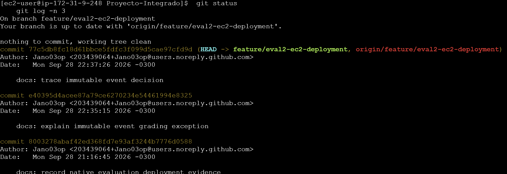
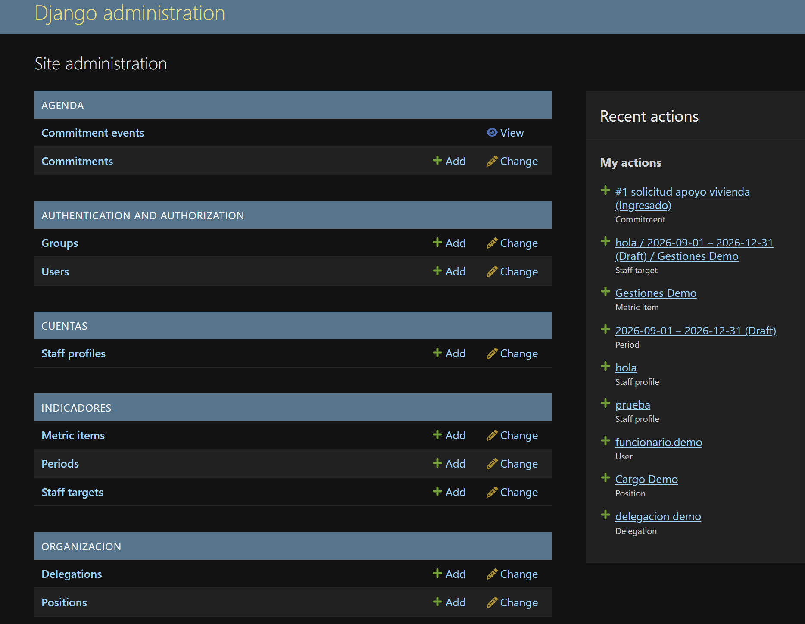
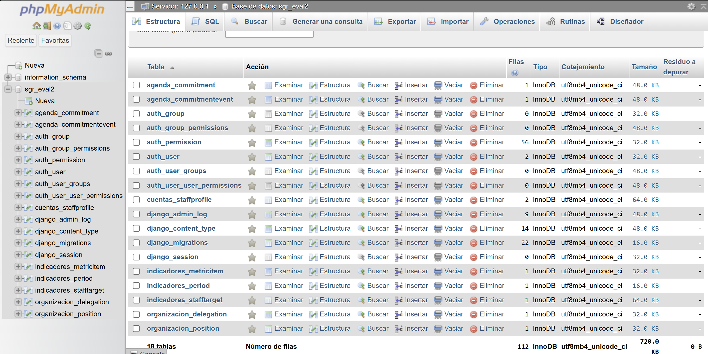
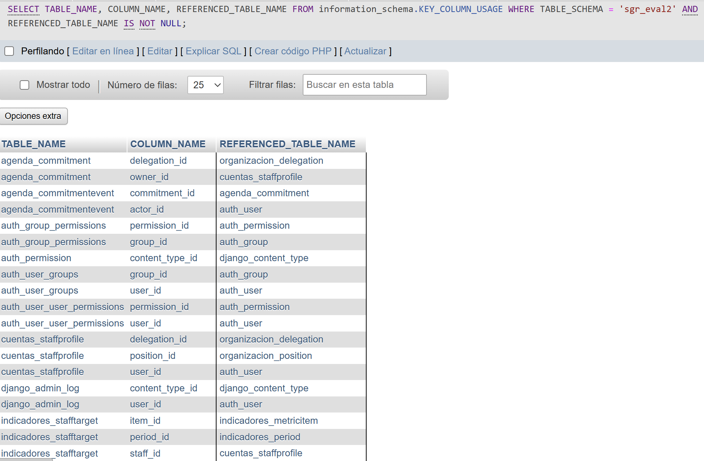

# Informe Técnico — Evaluación Sumativa 2 (Evidencias de Despliegue)

Este documento Markdown constituye la fuente para la entrega requerida en formato PDF o Word. El despliegue actual corresponde a una demostración privada en una instancia Amazon Linux 2023 EC2 a través de un túnel cifrado SSH, no a un sitio productivo con HTTPS público. La línea base descrita en `docs/sgr-system-specification.md` corresponde a la planificación previa y no al estado operativo alcanzado en este despliegue.

## 1. Decisiones de arquitectura y excepción de rúbrica

Se determinó conservar `CommitmentEvent` como un historial de auditoría de solo anexado (*append-only*). Sus métodos `save()` y `delete()` rechazan explícitamente modificaciones o eliminaciones sobre eventos existentes (`agenda/models.py:289-301`). Asimismo, la configuración de Django Admin prohíbe añadir, modificar o eliminar eventos en el inline o en la vista directa, limitando el acceso a registros de solo lectura y búsqueda (`agenda/admin.py:7-28,89-122`). La creación de un `Commitment` genera automáticamente su evento inicial (`agenda/models.py:170-208`). La suite de pruebas valida la inmutabilidad y los permisos en el Admin (`agenda/tests.py:174-201,362-384`).

**Discrepancia con la rúbrica / Riesgo de evaluación:** El documento `Eva Sumativa 2.pdf` (pág. 5) exige operaciones completas de creación, edición, eliminación, visualización y búsqueda en Django Admin para **cada entidad modelada**. Dado que `CommitmentEvent` prohíbe intencionalmente la creación/edición/eliminación directa para proteger la trazabilidad de auditoría, el CRUD literal para la totalidad de entidades **no se cumple**. Esta es una decisión arquitectónica consciente asumida con riesgo de calificación, documentada con transparencia técnica en lugar de simular conformidad mediante atajos artificiales.

**Ruta de demostración:** En Django Admin, crear un `Commitment` sintético y luego inspeccionar el `CommitmentEvent` generado de forma automática tanto en el inline de solo lectura como en el listado de eventos. Verificar que la interfaz no ofrece controles de creación, modificación ni borrado para eventos.

## 2. Estado verificado del sistema

El siguiente cuadro resume el estado operativo verificado y documentado en `odd/tasks/eval2-ec2-no-docker.md`:

| Área | Estado Verificado | Estado de Evidencia |
| --- | --- | --- |
| Nube y Clon de GitHub | Instancia EC2 AL2023 con Python 3.12.14 instalado en paralelo a la versión base 3.9. Clon en `/home/ec2-user/Proyecto-Integrado` en rama `feature/eval2-ec2-deployment`, commit `77c5db8`. Árbol de trabajo limpio. | Capturada (Captura de terminal EC2). |
| Base de Datos Relacional | MariaDB 10.11.18 en `127.0.0.1:3306`. 18 tablas InnoDB migradas, 19 claves foráneas (FK), 22 migraciones aplicadas. 9 registros sintéticos creados desde Admin; 0 claves foráneas huérfanas. | Capturada (Estructura y consulta de FKs en phpMyAdmin). |
| Servicio Web Privado | Gunicorn y proxy inverso Nginx aislados, vinculados a `127.0.0.1:8000/8001`. phpMyAdmin 5.2.3 en loopback 8080. Acceso privado vía túnel SSH en puertos 8001 y 8080. | Capturada (Dashboard de Admin y estructura). |
| Seguridad y Entrega | `manage.py check --deploy` reporta backend de correo de consola (`mail.E001`) y advertencias de cookies/HTTPS (`W004/W008/W012/W016`). Válido para demostración bajo túnel SSH, no para producción pública. | Documentado con transparencia técnica. |
| Gobernanza de IA | Asistencia de IA guiada por el desarrollador, límites operativos estrictos, Organic Driven Development (ODD) y cero datos ficticios/inventados. | Documentado en Sección 4. |

## 3. Evidencias visuales de despliegue

### 3.1 Evidencia de runtime en EC2 y clon de Git

**Sesión e historial de commits:** El prompt muestra `ec2-user@ip-172-31-9-248` en el directorio `Proyecto-Integrado`. `git status` verifica que la rama `feature/eval2-ec2-deployment` está sincronizada con `origin` y con el árbol de trabajo limpio. `git log -n 3` confirma el commit `77c5db8` (`docs: trace immutable event decision`), precedido por `e40395d` y `8003278`.

### 3.2 Evidencia del panel de Django Admin y eventos inmutables

**Panel de administración y auditoría de entidades:** Acceso privado en `http://localhost:8001/admin/` mediante el túnel SSH.
- **Creación de entidades:** El historial de "Recent actions" acredita nueve registros sintéticos generados desde el Admin: Delegación (`delegacion demo`), Cargo (`Cargo Demo`), Usuario (`funcionario.demo`), dos Perfiles de personal (`prueba`, `hola`), Período (`2026-09-01 – 2026-12-31`), Métrica (`Gestiones Demo`), Meta de personal y Compromiso (`#1 solicitud apoyo vivienda`).
- **Inmutabilidad en la interfaz:** En el módulo `AGENDA`, `Commitments` dispone de opciones de creación y modificación, mientras que `Commitment events` ofrece exclusivamente el enlace de visualización `View` (sin controles de añadir, editar ni borrar).

### 3.3 Evidencias en phpMyAdmin (Estructura de base de datos)

**Resumen de tablas:** Encabezado con servidor `127.0.0.1` y base de datos `sgr_eval2`. 18 tablas bajo el motor InnoDB con integridad transaccional y filas pobladas (incluyendo `agenda_commitment` y `agenda_commitmentevent`).

### 3.4 Verificación de integridad referencial (Claves foráneas)

**Integridad referencial:** Consulta sobre `INFORMATION_SCHEMA.KEY_COLUMN_USAGE` demostrando referencias activas entre tablas (incluyendo `agenda_commitmentevent.commitment_id` → `agenda_commitment.id`). Una consulta independiente sobre la base de datos verificó el total de 19 restricciones de clave foránea activas.

## 4. Uso de Inteligencia Artificial y metodología de trabajo

En conformidad con las pautas de la Evaluación 2, se utilizó Inteligencia Artificial como asistente de pair-programming bajo supervisión humana explícita, respetando una estricta disciplina de ingeniería:

### 4.1 Gobernanza humana y límites operativos
- **Dirección humana:** El desarrollador mantiene el control de la arquitectura, define los límites de seguridad, autoriza las operaciones de Git y gestiona directamente las credenciales sensibles.
- **Privacidad y cero invención de datos:** No se expusieron secretos de producción, credenciales de AWS ni datos personales reales. Todas las evidencias (tablas, migraciones, pruebas y capturas) fueron ejecutadas y verificadas de manera real y reproducible; no se admitieron transcripciones inventadas ni estados simulados.

### 4.2 Metodología operativa (Organic Driven Development)
- **Slices de revisión acotados:** El trabajo se estructuró en incrementos revisables (~400 líneas modificadas por slice) bajo la estrategia `stacked-to-main` para facilitar la auditoría y mantener límites claros de commit.
- **Diagnóstico arquitectónico:** La IA asistió en resolver desajustes de entorno (como el error CSRF 403 en el proxy Nginx a través del túnel SSH, corrigiendo el encabezado `Host $http_host`) y en desacoplar suites de test hacia fixtures sintéticos en lugar de archivos JSON privados.
- **Honestidad técnica frente a atajos:** En lugar de implementar soluciones cosméticas para simular el cumplimiento literal del CRUD en cada entidad, se preservó la inmutabilidad de `CommitmentEvent` para resguardar la pista de auditoría, documentando abiertamente las compensaciones de calificación y las advertencias de despliegue (`manage.py check --deploy`).

**Paquete de entrega preparado:** El informe técnico se encuentra compilado con sus 4 figuras en `docs/eval2-technical-report.docx` (apto para entrega directa en Word o exportación a PDF). Datos sintéticos y divulgación arquitectónica verificados.
