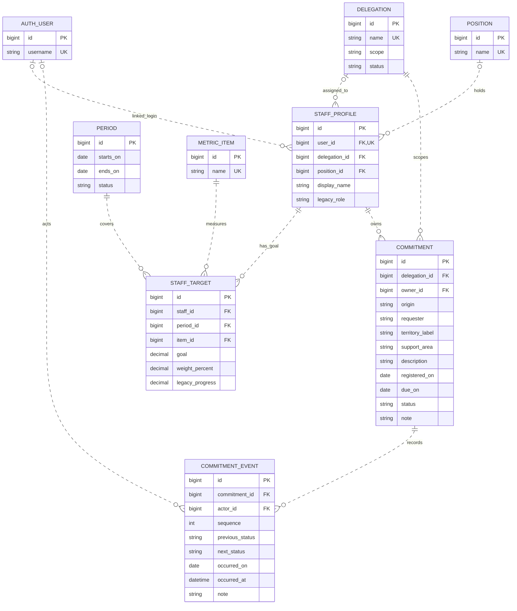

# First-delivery SGR MER — proposed MySQL relational core

**Decision for review:** Model the current four JSON-backed modules with **nine entities**: Django `AUTH_USER` plus `DELEGATION`, `POSITION`, `STAFF_PROFILE`, `PERIOD`, `METRIC_ITEM`, `STAFF_TARGET`, `COMMITMENT`, and `COMMITMENT_EVENT`. Approved first-release policy uses Django auth for sole login, globally shared positions, targets per staff/period/item, controlled period and commitment lifecycles, and an agenda percentage separate from indicator scoring. Preserve history, but do not pretend name-based legacy actor/owner fields are already FKs. This is a **proposal**, not an implemented ORM, Admin configuration, migration, database, authorization system, or deployment. [Product decisions: `odd/tasks/sgr-backend-mysql-mer.md` T2; observed baseline: `cuentas/services.py`, `agenda/services.py`, `indicadores/views.py`; local specification “Current local baseline vs delivery stages”.]

## Review path and boundary

1. Review the ten FK relationships and optionality below, then the approved policies and legacy reconciliation boundary.
2. Validate implementation details and data quality **before** importing any records or treating historical progress as verified output; the first-release identity, period and goal policies are already approved.
3. If implemented for the backend assessment, every modeled entity, including the built-in user via its own Admin facility, needs appropriate Admin operations and ORM-backed views; this document claims none of those exists today. The assessment slice is smaller than the full SGR guide's activity → evidence → independent-review chain and audit obligations. [Local specification, “Current local baseline vs delivery stages”, lines 216–228; `modelo-logico.md` CU-03, CU-05, CU-07.]

## Proposed ER diagram

Dashed (`..`) edges represent non-identifying relationships: each child has its own surrogate PK rather than inheriting a parent key. They still represent proposed, enforced MySQL InnoDB foreign keys. `o|` at the parent end means the child may reference **zero or one** parent; `||` means exactly one. `o{` at the child end means the parent may have zero to many children. Staging exceptions and stricter rules for **new** writes are stated below; the picture shows the proposed canonical schema's nullable fields, not a raw JSON import. [Design: `modelo-logico.md` CU-01, CU-02, CU-04; `cuentas/services.py`, `agenda/services.py`.] [Mermaid ER notation](https://github.com/mermaid-js/mermaid/blob/develop/packages/mermaid/src/docs/syntax/entityRelationshipDiagram.md).

`AUTH_USER` denotes Django's built-in auth user relation, **not** a new SGR table. IDs are proposed MySQL-compatible integer surrogate keys (`BIGINT`/Django big auto keys for new SGR rows); their actual Django PK type must match the project's auth configuration when implemented. `UK` in the diagram marks proposed uniqueness; composite constraints are listed below. `legacy_role` is **display/import metadata only**, never a delegation authorization grant. [Design; `cuentas/services.py` lines 37–53, 65–83; `cuentas/views.py` lines 13–31.]

### FK and cardinality inventory

| Parent → child FK | Parent → children; child → parent | Canonical nullability / new-write policy |
| --- | --- | --- |
| `AUTH_USER` → `STAFF_PROFILE.user_id` | 1 → 0..1 (unique); profile → 0..1 user | Nullable for staff with no reconciled login; new account-linked profile must reference a valid user. |
| `DELEGATION` → `STAFF_PROFILE.delegation_id` | 1 → 0..n; profile → 0..1 delegation | Nullable for unassigned profile; no scoped operation before assignment. Public self-registration is disabled. |
| `POSITION` → `STAFF_PROFILE.position_id` | 1 → 0..n; profile → 0..1 position | Nullable for unassigned profile; no invented position on import. |
| `STAFF_PROFILE` → `STAFF_TARGET.staff_id` | 1 → 0..n; target → exactly 1 staff | NOT NULL. |
| `PERIOD` → `STAFF_TARGET.period_id` | 1 → 0..n; target → exactly 1 period | NOT NULL; unresolved period goes to import exceptions, not a fabricated FK. |
| `METRIC_ITEM` → `STAFF_TARGET.item_id` | 1 → 0..n; target → exactly 1 item | NOT NULL; reconcile item labels first. |
| `DELEGATION` → `COMMITMENT.delegation_id` | 1 → 0..n; commitment → exactly 1 delegation | NOT NULL for accepted rows and new writes; unresolved territory/owner scope stays outside canonical import. |
| `STAFF_PROFILE` → `COMMITMENT.owner_id` | 1 → 0..n; commitment → exactly 1 owner | NOT NULL for accepted rows and new writes; do not guess a person from a partial name. Fixed after assignment in the first release. |
| `COMMITMENT` → `COMMITMENT_EVENT.commitment_id` | 1 → 0..n; event → exactly 1 commitment | NOT NULL; new commitment is saved with its first event in the same transaction. |
| `AUTH_USER` → `COMMITMENT_EVENT.actor_id` | 1 → 0..n; event → 0..1 actor | Nullable **only** for unresolved historical actors; application requires actor on new events. Retain original legacy actor in a restricted import report, not as an authorized principal. |

### Stored attributes and integrity rules

- `DELEGATION`: `name` and `scope` (`ambito`) are labels, `status` maps the current active/inactive label; `POSITION` is a **shared global** job-title catalog with a proposed unique normalized name, not one row per person or delegation. `STAFF_PROFILE` holds a display name and optional delegation/position FKs. Staff with login have a unique nullable `user_id`; `AUTH_USER.username` is its own unique credential identity. Review job-label collisions/synonyms before applying global uniqueness. [Product decision: T2; observed labels: `organizacion/services.py` lines 26–45, 78–94; `cuentas/services.py` lines 65–83.]
- `PERIOD.starts_on`/`ends_on` are real `DATE` values with `starts_on <= ends_on`; no invented dates from a year-only label. First-release periods cannot overlap (inclusive endpoints count as overlap), at most one period can be active, and closed periods and their targets/results are read-only with **no reopening** in this release. For a valid inclusive period, `total_days = (ends_on - starts_on).days + 1` and `elapsed_days = min(max((today - starts_on).days + 1, 0), total_days)`; derive expected progress from `elapsed_days / total_days`, not a hardcoded 90/91 days or the prototype's exclusive difference. `METRIC_ITEM.name` is a normalized catalog key only after collisions/synonyms are reviewed. `STAFF_TARGET` has `UNIQUE(staff_id, period_id, item_id)`, `goal > 0`, `0 <= weight_percent <= 100`, and optional nonnegative `legacy_progress`; use `DECIMAL` rather than floating-point. Draft staff/period targets may have incomplete weights, but require **exactly 100% summed across that staff/period** before computing a weighted result. Imported `avance` remains labeled provisional `legacy_progress`; any demonstration weighted total derived from it remains **provisional**, not a verified score from approved evidence. [Product decisions: T2; observed current calculation/edit path: `indicadores/views.py` lines 175–224; source shape: `indicadores/services.py` lines 24–38; future verified-results precedent: `modelo-logico.md` CU-05.]
- `COMMITMENT` keeps `origin`, `requester`, `territory_label`, `support_area`, `description`, `note` and recorded/due dates as source facts, with independently resolved `delegation_id` and `owner_id`; `territory_label` is **not** itself a delegation FK. `registered_on` and `due_on` use `DATE` when full dates are known. `status` uses the current four labels in order, `Ingresado → Pendiente → En proceso → Realizado`, but **normal first-release changes may only advance one step**; overdue is derived from due date, status and today, not stored. The owner is fixed after creation in this release. No period FK: agenda due dates and percentages are independent of measurement-period closure; do not infer period assignment from the due date. [Product decisions: T2; observed states/data: `agenda/services.py` lines 16–20, 57–76, 107–156; `modelo-logico.md` CU-02, CU-04.]
- `COMMITMENT_EVENT`: `UNIQUE(commitment_id, sequence)` maintains imported array order even when events share a date. Nullable `previous_status` for the initial event, required `next_status`, `occurred_on` as `DATE` for legacy day-only records, and `note` preserve source facts; nullable `occurred_at` is reserved for an actual timestamp on new events, never synthesized for old records. On new writes an authenticated actor and actual timestamp are required. A backward transition or reopening is allowed **only** to the delegated manager of that commitment's delegation or a coordinator, with authenticated actor, required reason and append-only event history. Status change and event insertion are one atomic transaction; restrict ordinary event edits/deletes through Admin/application policy. This is a new rule, **not** a claim that the JSON updater validates transitions or roles. [Product decisions: T2; observed updater: `agenda/services.py` lines 147–155, 163–190; historic-event precedent: `modelo-logico.md` CU-04.]
- Proposed database engine is **MySQL InnoDB** with actual FK constraints and supporting indexes on FKs and frequent filters, e.g. `COMMITMENT(delegation_id, status, due_on)` and `STAFF_TARGET(period_id, staff_id)`. Use unique constraints for keys and enforced `CHECK` for row-local date/range/value checks **only on MySQL 8.0.16+**; also validate in Django and test against the deployed server version. Cross-row weight sums, assignment/scope consistency, valid transitions, role checks, event immutability and overlap policy require application/transaction rules, not a row `CHECK`. Never copy PostgreSQL `daterange` or assume a `CHECK` enforces scoped access. [Design: `modelo-logico.md` CU-01 note, CU-04; local specification lines 195, 212, 246–250.] [MySQL 8.0 reference: CHECK constraints](https://dev.mysql.com/doc/refman/8.0/en/create-table-check-constraints.html).

## Legacy-to-proposal mapping (no raw dataset required)

| JSON shape / current behavior | Proposed destination and reconciliation boundary |
| --- | --- |
| `personas`: `nombre`, `cargo`, `rol`, `delegacion`, `usuario`, `correo`, `password`, `items` | Name → `STAFF_PROFILE.display_name`; reviewed global job/delegation labels → optional position/delegation FKs; role text → non-authoritative legacy label. Username/email → proposed `AUTH_USER` only after identity deduplication and authorized reconciliation. **Never automatically copy JSON hashes or passwords**: `cuentas/services.py` uses JSON hashers, but its login is not Django auth. Provision fresh credentials securely through admin-only account creation after implementation; validate conflicts, and hold ambiguous matches in restricted reconciliation. Missing usernames or duplicate names are not identity. Nested items → `STAFF_TARGET` after matching staff/period/item; `avance` → provisional `legacy_progress`, not verified score. [`cuentas/services.py` lines 37–83; `cuentas/forms.py` lines 19–28; `organizacion/services.py` lines 78–94; product decisions: T2.] |
| `delegaciones`: `id`, `nombre`, `ambito`, `estado` | `DELEGATION`; legacy numeric `id` may be kept as PK only if verified unique and safe, otherwise maintain a private old→new key mapping. Case/whitespace normalized name collisions require review before unique insertion. [`organizacion/services.py` lines 26–74.] |
| `compromisos`: `id`, `origen`, `solicitante`, `territorio`, `responsable`, `area_apoyo`, `descripcion`, `estado`, `observacion`, `fecha_registro`, `fecha_compromiso` | `COMMITMENT` facts and dates; resolve one explicit delegation and owner before canonical import. Keep `territorio` as a label, not a guaranteed delegation match. Legacy `id` mapping follows the same uniqueness check; unresolved/ambiguous names or dates go to a restricted reconciliation report, never silently create users, delegations or placeholder FKs. [`agenda/services.py` lines 57–85, 125–161; `cuentas/views.py` lines 128–140.] |
| Each commitment's `historial` entries: `estado_anterior`, `estado_nuevo`, `autor`, `fecha`, `observacion` | Ordered `COMMITMENT_EVENT` rows with sequence per array position; `estado_anterior` may be null on creation. Resolve actor against an approved login identity only if unambiguous; otherwise nullable historical actor. Do not infer time of day or overwrite history with current status; report inconsistencies. [`agenda/services.py` lines 147–155, 163–190.] |
| `periodo.inicio`/`termino`; each person's `items.nombre`/`meta`/`avance`/`ponderador`; request-time `Calculo.meta` | Valid full dates → `PERIOD`; normalized item labels → `METRIC_ITEM`; per-person settings → `STAFF_TARGET` for explicitly matched staff/period/item. Duplicates and missing period associations need review. `Calculo` is computed in the request, **not stored in JSON**; use the approved inclusive day policy in future calculations. Expected daily progress, percentage, provisional demonstration weighted total and colors are derived presentation values, not independent mutable or verified-result tables. [`indicadores/services.py` lines 24–38; `indicadores/views.py` lines 175–224; product decisions: T2; `modelo-logico.md` CU-05.] |

Import uses a separate, access-restricted dry-run reconciliation report (source reference, reason, candidate matches, resolution); keep ambiguous rows outside canonical FK tables until approved. Stage identity and label matching before inserting targets/commitments, then load history by source order in transactions. A temporary nullable staging representation may be used during ETL, but do not weaken final required FKs or expose unresolved people in general Admin. Use only synthetic or authorized redacted fixtures for design/review; this document contains no record values. [Design; local specification lines 212–214, 246–249.]

## Authorization and future insertion points

**Approved authentication target, not current behavior:** Django `auth.User` is the **sole login identity**, linked to `STAFF_PROFILE` through its unique nullable FK. Only admins create accounts in `/admin` after implementation; disable public registration and provision fresh credentials via a secure channel/reset, never by automatically importing JSON hashes. An unassigned profile/login has **no scoped access** until its delegation/profile assignment and server-side role/scope checks are established. Current login checks JSON hashes and stores name/role/username in session, `registro_view` offers public JSON registration, and the indicators landing can choose a random person without login; none proves SGR-scoped permission. Retire those paths/fallback before protected operations. A `Group` or `legacy_role` alone cannot grant delegation-scoped roles; role and delegation authorization still must be implemented. [`cuentas/forms.py` lines 19–28; `cuentas/views.py` lines 13–64; `indicadores/views.py` lines 8–39; product decisions: T2; local specification lines 195, 212.]

**Approved agenda display rule, not current behavior:** on the **Actividad → Agenda colectiva** board, for the selected inclusive date range and the **same authorized scope and active board filters**, count all visible commitments whose `due_on` falls within that range. Display `100 × (count with status Realizado / total matching commitments)%`; when the denominator is zero display **N/A**, not 0% and not a divide-by-zero result. This is a derived presentation value, not a stored target or indicator score. An eventual agenda contribution to indicator scoring is optional future work and requires a separately approved counting rule. Agenda remains independent of period closure (no `period_id` on `COMMITMENT`). [`agenda/services.py` lines 16–20, 57–77; product decisions: T2; future one-time-counting concern: `modelo-logico.md` CU-02, CU-05.]

**Deferred:** activity linked to staff/period/item/delegation; private evidence linked to activity; independent review linked to evidence/reviewer; optional originating activity FK on commitment **only when activity exists**. The **next increment** also plans commitment-owner reassignment, recording authenticated actor, actual time, reason and old/new owners in history; how to attribute historical ownership counts after reassignment remains a future decision. Do not add a first-release reassignment table, FK or mutable owner workflow. Later derive evidence-verified scores from approved activity and consider versioned closure snapshots; do not relabel `legacy_progress` as approved. The full guide also calls for audit, cross-delegation authorization, retention and historic targets; deferral here is a sequencing decision for the smaller evaluation, **not** a declaration that audit or approval is optional in a full SGR. Social cases, collaboration, alerts and reporting enhancements likewise stay outside these nine first-delivery entities. [Product decisions: T2; local specification lines 195–197, 203–214, 220–255; `modelo-logico.md` CU-02, CU-03, CU-05, CU-07.]

## Approved first-release policies

These are **product decisions** recorded in `odd/tasks/sgr-backend-mysql-mer.md` T2, not requirements inferred from `modelo-logico.md` or a claim that the current JSON application already enforces them.

| Area | Approved rule |
| --- | --- |
| Accounts and organization | `auth.User` alone authenticates; admin-only `/admin` provisioning with fresh secure credentials, no public registration or automatic JSON-hash import. Deny scoped operations until assigned profile/delegation and implemented server-side authorization. `POSITION` is global; ambiguous identities, owner/delegation labels and collisions remain in restricted reconciliation. |
| Periods and targets | Per-staff/period/item goal; inclusive calendar days, non-overlapping periods, at most one active; closed periods immutable and not reopened this release. Draft weights can be incomplete; weighted computation requires 100% per staff/period. Imported progress and any derived demonstration total are provisional, not evidence-verified. |
| Agenda | Board percentage uses `Realizado / all due commitments` in the inclusive selected range under identical board scope/filters; no matching commitments → N/A. It is separate from indicator scoring and period closure. Normal status changes advance one ordered step; only the delegated manager for the commitment's own delegation or coordinator may retrocede/reopen, with authenticated actor, reason, append-only event and atomic status/event write. Owner stays fixed in this release. |
| Next increment, not first-release schema | Owner reassignment is planned next with actor/time/reason/old and new owner; historical ownership-count attribution remains unresolved. Optional agenda contribution to the indicator score requires its own later approved rule. Activity, evidence, independent review and full-SGR audit obligations remain deferred, not discarded. |

## Remaining pre-implementation validations

| Validation | Why it remains open |
| --- | --- |
| Actual MySQL server/version, auth PK type and constraint support | Check deployed InnoDB/MySQL capabilities (including enforced `CHECK` on 8.0.16+) and Django auth configuration before writing migrations; application/transaction validation remains necessary for overlap, single-active, sum of weights and scoped transitions. |
| Legacy identity, source dates and catalog data quality | Run restricted dry-run reconciliation to inspect duplicates, invalid/full dates, overlapping candidate periods, username and global job/item label collisions, owner/delegation/actor ambiguity, and historical transition conflicts before canonical import. Do not guess matches or invent timestamps. |
| Secure credential delivery and scoped-role implementation details | Choose a secure, approved provisioning/reset channel and implement/test role plus delegation checks; neither the channel nor authorization code is established in this proposal. Public self-registration is already ruled out. |
| Future scoring and reassignment attribution | If later desired, separately decide whether/how agenda completion contributes to indicator scoring, and whether historical ownership counts follow original or new owners; do not infer either policy for this release. |

**Acceptance for this design:** reviewers can identify all nine PKs, all ten child FKs and nullability from diagram/inventory; trace the four source shapes without private records; distinguish provisional and verified values and approved policies from pending validation; and see the boundary between first release and deferred obligations. This document does not claim a successful migration, working Admin or scoped authorization, tests, MySQL setup or EC2 deployment. [Local specification lines 216–242; product decisions: T2.]
