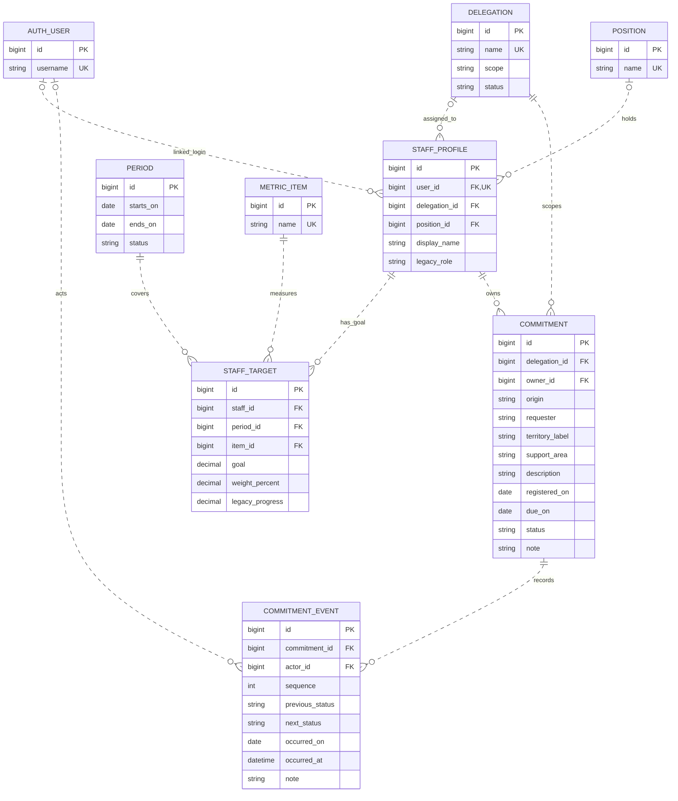

# First-delivery SGR MER — proposed MySQL relational core

**Decision for review:** Model the current four JSON-backed modules with **nine entities**: Django `AUTH_USER` plus `DELEGATION`, `POSITION`, `STAFF_PROFILE`, `PERIOD`, `METRIC_ITEM`, `STAFF_TARGET`, `COMMITMENT`, and `COMMITMENT_EVENT`. A target is per staff member, period and item because that is where the prototype stores its values; a commitment belongs to one delegation and has an owner. Preserve agenda history, but do not pretend its name-based actor/owner fields are already FKs. This is a **proposal**, not an implemented ORM, Admin configuration, migration, database, or deployment. [Local specification: “Proposed conceptual data model”, “Current local baseline vs delivery stages”; `modelo-logico.md` CU-01, CU-02, CU-04, CU-05.]

## Review path and boundary

1. Review the ten FK relationships and optionality below, then the legacy mapping and unresolved decisions.
2. Confirm the identity and period/goal rules **before** importing any records or treating historical progress as verified output.
3. If implemented for the backend assessment, every modeled entity, including the built-in user via its own Admin facility, needs appropriate Admin operations and ORM-backed views; this document claims none of those exists today. The assessment slice is smaller than the full SGR guide's activity → evidence → independent-review chain and audit obligations. [Local specification, “Current local baseline vs delivery stages”, lines 216–228; `modelo-logico.md` CU-03, CU-05, CU-07.]

## Proposed ER diagram

Dashed (`..`) edges represent non-identifying relationships: each child has its own surrogate PK rather than inheriting a parent key. They still represent proposed, enforced MySQL InnoDB foreign keys. `o|` at the parent end means the child may reference **zero or one** parent; `||` means exactly one. `o{` at the child end means the parent may have zero to many children. Staging exceptions and stricter rules for **new** writes are stated below; the picture shows the proposed canonical schema's nullable fields, not a raw JSON import. [Design: `modelo-logico.md` CU-01, CU-02, CU-04; `cuentas/services.py`, `agenda/services.py`.] [Mermaid ER notation](https://github.com/mermaid-js/mermaid/blob/develop/packages/mermaid/src/docs/syntax/entityRelationshipDiagram.md).

`AUTH_USER` denotes Django's built-in auth user relation, **not** a new SGR table. IDs are proposed MySQL-compatible integer surrogate keys (`BIGINT`/Django big auto keys for new SGR rows); their actual Django PK type must match the project's auth configuration when implemented. `UK` in the diagram marks proposed uniqueness; composite constraints are listed below. `legacy_role` is **display/import metadata only**, never a delegation authorization grant. [Design; `cuentas/services.py` lines 37–53, 65–83; `cuentas/views.py` lines 13–31.]

### FK and cardinality inventory

| Parent → child FK | Parent → children; child → parent | Canonical nullability / new-write policy |
| --- | --- | --- |
| `AUTH_USER` → `STAFF_PROFILE.user_id` | 1 → 0..1 (unique); profile → 0..1 user | Nullable for staff with no reconciled login; new account-linked profile must reference a valid user. |
| `DELEGATION` → `STAFF_PROFILE.delegation_id` | 1 → 0..n; profile → 0..1 delegation | Nullable for unassigned/self-registered profile; no scoped operation before assignment. |
| `POSITION` → `STAFF_PROFILE.position_id` | 1 → 0..n; profile → 0..1 position | Nullable for unassigned profile; no invented position on import. |
| `STAFF_PROFILE` → `STAFF_TARGET.staff_id` | 1 → 0..n; target → exactly 1 staff | NOT NULL. |
| `PERIOD` → `STAFF_TARGET.period_id` | 1 → 0..n; target → exactly 1 period | NOT NULL; unresolved period goes to import exceptions, not a fabricated FK. |
| `METRIC_ITEM` → `STAFF_TARGET.item_id` | 1 → 0..n; target → exactly 1 item | NOT NULL; reconcile item labels first. |
| `DELEGATION` → `COMMITMENT.delegation_id` | 1 → 0..n; commitment → exactly 1 delegation | NOT NULL for accepted rows and new writes; unresolved territory/owner scope stays outside canonical import. |
| `STAFF_PROFILE` → `COMMITMENT.owner_id` | 1 → 0..n; commitment → exactly 1 owner | NOT NULL for accepted rows and new writes; do not guess a person from a partial name. |
| `COMMITMENT` → `COMMITMENT_EVENT.commitment_id` | 1 → 0..n; event → exactly 1 commitment | NOT NULL; new commitment is saved with its first event in the same transaction. |
| `AUTH_USER` → `COMMITMENT_EVENT.actor_id` | 1 → 0..n; event → 0..1 actor | Nullable **only** for unresolved historical actors; application requires actor on new events. Retain original legacy actor in a restricted import report, not as an authorized principal. |

### Stored attributes and integrity rules

- `DELEGATION`: `name` and `scope` (`ambito`) are labels, `status` maps the current active/inactive label; `POSITION` is a reusable job-title catalog, not one row per person. `STAFF_PROFILE` holds a display name and optional delegation/position FKs. Staff with login have a unique nullable `user_id`; `AUTH_USER.username` is its own unique credential identity. Confirm whether position names are global or delegation-specific before finalizing `POSITION.name` uniqueness. [Design; `organizacion/services.py` lines 26–45, 78–94; `cuentas/services.py` lines 65–83; `modelo-logico.md` CU-01.]
- `PERIOD.starts_on`/`ends_on` are real `DATE` values with `starts_on <= ends_on`; no invented January/December from a year-only label. Multiple periods need an explicit overlap/closure policy before launch. `METRIC_ITEM.name` is a normalized catalog key only after collisions/synonyms are reviewed. `STAFF_TARGET` has `UNIQUE(staff_id, period_id, item_id)`, `goal > 0`, `0 <= weight_percent <= 100`, and optional nonnegative `legacy_progress`; use `DECIMAL` rather than floating-point for values and weights. Decide whether weights must sum to 100 per staff/period and whether legacy progress is editable before implementation. Do not present historical progress as evidence-approved activity counts. [Design; `indicadores/services.py` lines 24–38; `indicadores/views.py` lines 196–224; `modelo-logico.md` CU-01, CU-05.]
- `COMMITMENT` keeps `origin`, `requester`, `territory_label`, `support_area`, `description`, `note` and recorded/due dates as source facts, with independently resolved `delegation_id` and `owner_id`; `territory_label` is **not** itself a delegation FK. `registered_on` and `due_on` use `DATE` when full dates are known. `status` is restricted to the four current agenda states; overdue is derived from due date, status and today, not stored. No period FK: the prototype stores no explicit commitment period, and assigning one by date needs a confirmed policy. [Design; `agenda/services.py` lines 16–20, 57–76, 107–156; `modelo-logico.md` CU-02, CU-04.]
- `COMMITMENT_EVENT`: `UNIQUE(commitment_id, sequence)` maintains the imported array order even when multiple events share the same date. Store nullable `previous_status` for initial event, required `next_status`, `occurred_on` as `DATE` for legacy day-only records, and `note`; nullable `occurred_at` is reserved for an actual timestamp on new events, never synthesized for old records. New events require an authenticated actor and timestamp. Changes to status and append-only event insertion must be one transaction; restrict ordinary updates/deletes on history through Admin/application policy. [Design; `agenda/services.py` lines 147–155, 163–190; `modelo-logico.md` CU-04.]
- Proposed database engine is **MySQL InnoDB** with actual FK constraints and supporting indexes on FKs and frequent filters, e.g. `COMMITMENT(delegation_id, status, due_on)` and `STAFF_TARGET(period_id, staff_id)`. Use unique constraints for keys and enforced `CHECK` for row-local date/range/value checks **only on MySQL 8.0.16+**; also validate in Django and test against the deployed server version. Cross-row weight sums, assignment/scope consistency, valid transitions, role checks, event immutability and overlap policy require application/transaction rules, not a row `CHECK`. Never copy PostgreSQL `daterange` or assume a `CHECK` enforces scoped access. [Design: `modelo-logico.md` CU-01 note, CU-04; local specification lines 195, 212, 246–250.] [MySQL 8.0 reference: CHECK constraints](https://dev.mysql.com/doc/refman/8.0/en/create-table-check-constraints.html).

## Legacy-to-proposal mapping (no raw dataset required)

| JSON shape / current behavior | Proposed destination and reconciliation boundary |
| --- | --- |
| `personas`: `nombre`, `cargo`, `rol`, `delegacion`, `usuario`, `correo`, `password`, `items` | Name → `STAFF_PROFILE.display_name`; reviewed job/delegation labels → optional position/delegation FKs; role text → non-authoritative legacy label. Username/email → proposed `AUTH_USER` only after consent/identity deduplication. **Do not automatically copy hashes or plaintext passwords**: `cuentas/services.py` uses JSON hashers, but its login is not Django auth. Plan secure account provisioning/reset and validate uniqueness/conflicts; missing username or duplicate names are not identity. Nested items → `STAFF_TARGET` after matching period/item; import `avance` only as labeled `legacy_progress`. [`cuentas/services.py` lines 37–83; `cuentas/forms.py` lines 19–28; `organizacion/services.py` lines 78–94.] |
| `delegaciones`: `id`, `nombre`, `ambito`, `estado` | `DELEGATION`; legacy numeric `id` may be kept as PK only if verified unique and safe, otherwise maintain a private old→new key mapping. Case/whitespace normalized name collisions require review before unique insertion. [`organizacion/services.py` lines 26–74.] |
| `compromisos`: `id`, `origen`, `solicitante`, `territorio`, `responsable`, `area_apoyo`, `descripcion`, `estado`, `observacion`, `fecha_registro`, `fecha_compromiso` | `COMMITMENT` facts and dates; resolve one explicit delegation and owner before canonical import. Keep `territorio` as a label, not a guaranteed delegation match. Legacy `id` mapping follows the same uniqueness check; unresolved/ambiguous names or dates go to a restricted reconciliation report, never silently create users, delegations or placeholder FKs. [`agenda/services.py` lines 57–85, 125–161; `cuentas/views.py` lines 128–140.] |
| Each commitment's `historial` entries: `estado_anterior`, `estado_nuevo`, `autor`, `fecha`, `observacion` | Ordered `COMMITMENT_EVENT` rows with sequence per array position; `estado_anterior` may be null on creation. Resolve actor against an approved login identity only if unambiguous; otherwise nullable historical actor. Do not infer time of day or overwrite history with current status; report inconsistencies. [`agenda/services.py` lines 147–155, 163–190.] |
| `periodo.inicio`/`termino`; each person's `items.nombre`/`meta`/`avance`/`ponderador`; request-time `Calculo.meta` | Valid full dates → `PERIOD`; normalized item labels → `METRIC_ITEM`; per-person settings → `STAFF_TARGET` for an explicitly matched period. Duplicates and missing period associations need review. `Calculo` is computed in the request, **not stored in JSON**; show expected daily progress, percentage, weighted score and colors as derived presentation values, not independent mutable tables. [`indicadores/services.py` lines 24–38; `indicadores/views.py` lines 175–224; `modelo-logico.md` CU-05.] |

Import uses a separate, access-restricted dry-run reconciliation report (source reference, reason, candidate matches, resolution); keep ambiguous rows outside canonical FK tables until approved. Stage identity and label matching before inserting targets/commitments, then load history by source order in transactions. A temporary nullable staging representation may be used during ETL, but do not weaken final required FKs or expose unresolved people in general Admin. Use only synthetic or authorized redacted fixtures for design/review; this document contains no record values. [Design; local specification lines 212–214, 246–249.]

## Authorization and future insertion points

**Authentication proposal, not current behavior:** link a profile to Django `AUTH_USER` via its unique nullable FK; use Django auth for new login and password provisioning only after an explicit transition plan. Current login checks JSON hashes and stores person name/role/username in session; the indicators landing can also choose a random person when no session identity exists. Neither path is proof of SGR-scoped identity or permission. Disable that fallback as part of a future implementation before any protected operation. A `Group` or `legacy_role` alone cannot encode delegation-scoped multi-role grants; for this assessment, authorize against explicit profile assignment and server-side scope checks, and decide the later scoped role-assignment model before expanding privileges. Unassigned self-registered accounts should have no scoped access. [`cuentas/forms.py` lines 19–28; `cuentas/views.py` lines 13–31; `indicadores/views.py` lines 8–39; `modelo-logico.md` CU-01 note; local specification lines 195, 212.]

**Deferred:** activity linked to staff/period/item/delegation; private evidence linked to activity; independent review linked to evidence/reviewer; optional originating activity FK on commitment **only when activity exists**. Later derive approved results from those records and consider versioned closure snapshots rather than treating `legacy_progress` as approved. The full guide also calls for audit, cross-delegation authorization, retention and historic targets; deferral here is a sequencing decision for the smaller evaluation, **not** a declaration that audit or approval is optional in a full SGR. Social cases, collaboration, alerts and reporting enhancements likewise stay outside these nine first-delivery entities. [Local specification lines 195–197, 203–214, 220–255; `modelo-logico.md` CU-02, CU-03, CU-05, CU-07.]

## Decisions to confirm before implementation

| Question / owner | Recommended default pending confirmation | Cost of getting it wrong |
| --- | --- | --- |
| Identity, credential transition, and import consent — product owner/security | Reconcile usernames manually; issue new credentials via approved reset; leave unmatched staff without login. | Account takeover or leaked credentials. |
| Delegation and owner matching; self-registration — organization owner | Explicitly resolve ambiguous legacy labels; allow unassigned profile but deny scoped operations; never insert unresolved commitments. | Cross-unit access or wrong ownership. |
| Position namespace and history — organization owner | Reuse one position per normalized name provisionally; confirm whether position is actually unit-specific and how reassignment history is retained. | False merging or loss of historical scope. |
| Period and target policy — indicator owner | Per-person `(staff, period, item)` uniqueness for this slice; require full dates; agree overlap, weight sums, period closure and changes to old targets before import. | Invented periods or retrospective score changes. |
| Progress provenance and agenda score — indicator/agenda owners | Label imported `avance` as unverified legacy progress; do not credit a commitment or calculate approved results until a validated rule exists. | Double counting or false verified results. |
| Agenda state, event and attribution — agenda owner | Preserve four current states and ordered events; require authenticated actor on new writes; get approval for corrections/reopenings and historical actor gaps. | Broken chronology or untraceable decisions. |

**Acceptance for this design:** reviewers can identify all nine PKs, all ten child FKs and nullability from diagram/inventory; trace the four source shapes without private records; see which values are derived versus stored; and distinguish approved first-delivery scope from deferred full-SGR obligations. This document does not claim a successful migration, working Admin, tests, MySQL setup, EC2 deployment or a final institutional policy. [Local specification lines 216–242.]
