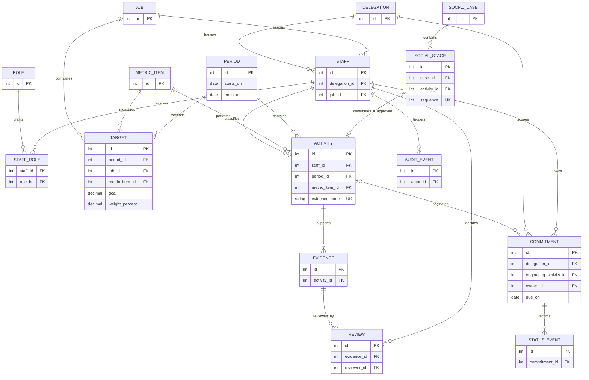

# SGR: reconstructing the results-management system

**Purpose:** A source-traceable blueprint for recreating the municipal delegation workflow and improving its reliability. This is a **design specification**, not a claim that the current Django prototype already implements it. Start with the source map and delivery stages below; use the detailed rules and scenarios when designing and verifying each feature.

## Source map and interpretation

| Tag | Primary source | Authority here |
| --- | --- | --- |
| **O p.N** | `PRESENTACIÓN  MATRIZ  REGIMIENTO RESULTADO.pdf`, PDF page N of 20 | Original workbook/presentation; visual observations are explicitly identified. |
| **G p.N** | `Guia_Proyecto_Software_SGR_Alumnos.pdf`, PDF page N of 30 | Academic SGR requirements and *provisional* prototype rules. |
| **E p.N** | `Eva Sumativa 2.pdf`, PDF page N of 10 | Separate backend assessment; not the complete SGR product scope. |
| **I path** | Local repository source at this writing | Observed prototype behavior; not a PDF requirement or proof of deployment. |
| **P** | This document's proposed implementation/design | Needs stakeholder approval; never silently promoted to an original rule. |

Page numbers are **PDF page positions**, not slide numbers inferred from thumbnails. The original's 20 pages were inspected as images as well as parsed text; screenshot observations below are deliberately paraphrased without reproducing images, people, contact details, identity numbers, or file identifiers. The guide itself says formal requirements take precedence over conflicting stories and ambiguities require an explicit decision (G p.3). The academic baseline is not an authorized municipal policy (G pp.12, 27).

## At a glance: problem, outcome, boundaries

Previously separate delegations lacked a shared record of requests and a common measurement tool. The original uses connected Google sheets to record individual work, future commitments, services, deadlines, and summaries (O pp.2–3). The target is a responsive, persistent, permissioned application supporting **record → classify → verify → calculate → act** (G pp.3–5). Preserve operational continuity and explain every indicator from its underlying records; support staff rather than automatically judging employment suitability (O p.20; G p.5).

**In scope for the full SGR design:** delegation/cargo setup; activity and social-service records; verifiable evidence; collective agenda and history; configurable periods, goals and weights; daily personal/delegation views; audit and controlled export (G pp.4–10, 27). **Outside initial scope:** payroll, budget, formal employment appraisal, complete omnichannel case management, electronic signing and unspecified municipal integrations (G p.5). This document does not implement code, transfer data, create cloud resources, or authorize deployment. Use only synthetic/anonymized examples (G p.3).

### Vocabulary

| Term | Meaning and distinction |
| --- | --- |
| Delegation | Organizational unit whose authorized staff and results are consolidated (O pp.5, 19; G pp.4–5). |
| Activity | Dated performed action, attributed to a worker and a measurable item; it is not automatically a future commitment (O pp.6–7; G p.6). |
| Item / goal / weight | Measured work category / target quantity or rate in a period / contribution to total score (O p.12; G pp.11–12). |
| Commitment ("tube") | Future action with owner, due date, state and follow-up; can originate from an activity (O p.13; G p.8). |
| Evidence / validation | Linked proof and a separate verifier decision; a code or an uploaded image alone does not establish approval (O pp.9–10; G pp.6, 8, 12). |
| Period | Bounded measurement window with frozen/versioned rules after closure (G pp.7, 10, 12, 27). |

## Original workbook: page-by-page visual reconstruction

The following records **what is visible** or stated, not a promise to copy the spreadsheet's layout or hidden formulas.

| O page | Screen or content observed | Design implication / uncertainty |
| --- | --- | --- |
| 1 | SGR presentation title over a generic business illustration. | No operational fields specified. |
| 2 | Narrative about isolated delegations and unrecorded requests beside an illustrative office photo. | Shared record and oversight are the core problem, not the decorative image. |
| 3 | Google-linked spreadsheets proposed for worker activities, neighbor commitments, service data, duties, deadlines and summaries. | Translate connected sheets into related records, not isolated screen replicas. |
| 4 | Screenshot of colored sheet tabs: rural unit, calendar, tube, job-specific sheets, complaints, traffic light, and a locked-looking summary tab. | Tab labels and lock icon are visual observations; they do **not** prove a permission system. |
| 5 | Cropped tabs show a delegation, shared tube, role-oriented sheets, traffic light and summary; text lists social, administrative, coordination and other jobs. | Provide navigation by capability and role; a job tab does not imply one database table per person. |
| 6 | Personal sheet has an upper item/weight/quarter-goal/current-progress/weighted-total matrix and lower activity rows. Visible row columns include date, issue, action, contact, phone, send-to-tube, item, code, image, verifier and result. | Split entry from derived metrics and protect contact data; no original contact values reproduced. |
| 7 | Expanded rows show dropdowns for item, send-to-tube and image verification, plus a result column. | Form validation and controlled vocabularies replace freeform spreadsheet cells. |
| 8 | Social sheet screenshot includes type/subtype, a person identifier/contact, visit flag, tube flag, first/second/third action and date/benefit/report fields, code, image, verifier and result. | Model one case with up to three ordered stages, not three separate people (G p.8). |
| 9 | Evidence crop shows photo code, image flag, validator flag and result; text says date entry creates a code used to name a related photo. | Code generation and actual evidence-to-activity matching must be specified separately. |
| 10 | Drive screenshots show verifier folders and image filenames resembling sheet-generated codes. | Preserve searchable code association; Drive folder/file UI is **not** a requirement to deploy Drive. |
| 11 | Personal summary screenshot shows ratios, weighted percentages and separate positive/negative adjustment rows. | Keep an auditable calculation trace; visible values alone do not settle adjustment policy. |
| 12 | Explicit concept definitions beside a summary table; "percentage" prose calls it a difference, but visual ratios behave like progress divided by goal. | Follow guide's ratio baseline pending official confirmation (G pp.12, 27). |
| 13 | Shared tube grid displays request date, issue, internal/external, requester, territory, owner, due date, area, observations, state and unit; colored status cells. | One commitment with assignment and history, not an unversioned editable row. |
| 14 | Per-worker and delegation totals show counts in Ingresado/Pendiente/En proceso/Realizado and realized percentage; narrative says 80% affects the worker's score. | Define denominator and point linkage explicitly before applying any score. |
| 15 | Traffic-light grid compares area/owner, expected-to-date, a 60% reference, actual progress and color; right panel has period arithmetic. | Color is not a substitute for displaying actual/expected numeric values. |
| 16 | Same grid plus text describes a 100% quarterly target in "90 days" and daily monitoring. | Do not hard-code 90; displayed period can have 91 days (O p.17; G p.27). |
| 17 | Period panel shows July 1–September 30 as **91** days, daily ~1.10%, and day 56 → ~61.54% expected. | Screenshot seems to use 56/91; inclusive/exclusive boundaries remain an explicit policy decision. |
| 18 | Delegation view combines color with last-entry date, elapsed days, entry count and daily average. | Separate measured output from logging frequency; absence of entries is a signal, not a verdict. |
| 19 | Global sheet combines job/item weights, goals, advances and weighted results with a roster and period dates; a **150% max** label appears in the screenshot. | Cap and roll-up must be parameterized; do not reuse screenshot identities. |
| 20 | Benefit text cites simultaneous Drive updates, cross-delegation coordination, editable weights, shared agenda, reports, accompaniment and photo/call verification. | Preserve collaboration and auditability; avoid turning score into formal personnel decisions (G p.5). |

### Screens and navigation translated into a web product (P)

1. **Home / delegation:** choose allowed period and delegation; show commitments, expected vs actual progress, freshness, and drill-down (O pp.5, 18–19; G pp.9–10).
2. **My work:** enter activities under current cargo's active item catalog; show pending proof and verification alongside item-level progress (O pp.6–7; G pp.7–8).
3. **Social cases:** restricted case view with chronological stage cards and relevant service subtype; hide unnecessary contact fields in general dashboards (O p.8; G pp.8, 11, 14).
4. **Tube:** filter/search by territory, owner, state and due date; expose action history, reassignment and overdue state without exposing protected citizen details by default (O pp.13–14; G pp.8, 20).
5. **Traffic light / reports / administration:** accessible status label plus numbers and drill-down; period-scoped rule editor and export for authorized actors (O pp.15–19; G pp.7, 9–10).

## Actors and access: source vs proposal

The original names workers, delegate and coordinators for entry and shared follow-up (O pp.4–5, 13, 20). The guide adds administrator, verifier and read-only consultation roles and requires access limited by function and delegation (G pp.5–6). The following operation matrix is **P**, a least-privilege starting policy to approve, not a claim about spreadsheet locks or existing Django permissions.

| Actor (G p.5) | Own activity/proof | Shared commitments | Verify proof | Rules / reports |
| --- | --- | --- | --- | --- |
| Worker | Create/edit before approval within own scope | Create, view scope, update assigned item | No self-approval | Own dashboard only |
| Verifier | View assigned scope as necessary | View needed context | Approve/reject/request correction with reason; no self-verification | Review queue only |
| Delegate / manager | View unit records, follow up | Review/reassign within unit with reason | Only if separately granted verifier role and no conflict | Unit summary and authorized export |
| System coordinator | View allowed cross-unit summaries | Coordinate scoped records | Only if separately granted | Propose/version parameters across authorized units |
| Administrator | Configure users and scopes | Configure reference data, not impersonate owners | No implicit approval | Configure periods, catalogs and role assignments |
| Read-only user | View expressly granted, minimized detail | View allowed scope | No | Allowed reports, no edits |

Enforce scopes server-side for **read, search, export, create and mutation**; an invisible button is not authorization (G pp.11, 28). Define explicit role stacking, verifier assignment, segregation and exceptions before implementation (P). In particular, an operator in one delegation must not access another delegation by changing a URL or filter (G p.14, CA-07).

## Operational workflows and state

### Activity → evidence → approved point

1. Authorized worker selects period, active item and service subtype if relevant; records performed date, issue/action and minimal permitted contact reference. Validate formats, date window and item-to-cargo applicability (O pp.6–8; G pp.7, 14).
2. Save activity with an immutable, unique evidence code. If the issue creates future work, create/link **one** commitment, rather than copying text into an unrelated agenda row (O pp.7, 9, 13; G pp.6, 8).
3. Attach/reference allowed evidence by code; retain uploader and upload time. A code or "image yes" dropdown is not proof of an approved activity (O pp.9–10; G pp.8, 19).
4. Independent authorized verifier approves, rejects or requests correction with timestamp, reason and revision history; only approval contributes to the measured item. Rejection and annulment remove or prevent the contribution; corrections may resubmit but never double-count (G pp.6, 8, 12, 14, 19).
5. Recompute affected item, personal and delegation summaries for the selected period with drill-down to approved origin records (G pp.9, 14). **P:** atomic approval and idempotent score projection prevent duplicate points during retries.

**Proposed state sketch:** activity draft → submitted → evidence pending/review → approved **or** correction requested/rejected → resubmitted/annulled; approved is distinct from "photograph uploaded" (P). Define whether work without an image may be verified by a call; the original mentions calls but the guide's academic baseline demands validation approval (O p.20; G p.27).

### Commitment → due-date handling → history

An authorized worker creates a future commitment within a delegation, with origin (internal/external), requester reference, territory, owner, support area, description and due date; optionally link originating activity (O p.13; G pp.6–8). **P:** store `delegation_id` on the commitment to enforce its unit scope, rather than treating the territory label or owner's current delegation as the scope key. States are **Ingresado → Pendiente → En proceso → Realizado** in the original and guide; the guide asks for controlled transitions and previous/new state, author, time and observation on each change (O p.13; G pp.6, 8). **P:** allow reassignment or reopening only with reason and audit; decide permissible skips with product owner. Flag a due date passed without realization, record any extension and communication to the requester, and retain closed/late history (O p.13; G pp.8, 14, 20).

For a selected owner and period, present counts per state and `realized / eligible commitments × 100`; denominator definition, canceled records, reassignment ownership and late completion treatment are **open decisions**, not implied by the screenshot (O p.14; G pp.8, 12). Link realized commitment to a measurable item **only if configured and validated**, count it once, and reconcile delegation totals with filtered detail (G pp.8–9, 14). A 0-commitment denominator displays "not applicable," not 0% failure (P).

### Social service sequence

One restricted social case may record **up to three** dated, typed stages for the same user (e.g., synthetic `CASE-001`: intake → field visit → benefit follow-up). Each stage has its own outcome; identify the case once and show chronology without multiplying the person record (O p.8; G pp.8, 12–14). **P:** model stages as at most three sequence-numbered entries, with `UNIQUE(case, sequence)` and a transactional check for the maximum; do not use three separate citizen columns. Decide whether every stage contributes a separate measurable activity before scoring (open).

## Metrics: transparent calculation contract

The guide defines the **academic prototype baseline**, not an official personnel-scoring rule (G pp.12, 27):

| Quantity | Reproducible baseline and guards | Provenance |
| --- | --- | --- |
| Approved advancement | Count or configured result of valid approved activities for one item, worker and period; reversal/annulment must recalculate. | G pp.9, 12; O pp.7, 11 |
| Item completion | `approved advancement / goal × 100`; positive quantitative goal mandatory; percentage-valued items need an explicitly configured formula. This is a **ratio**, despite the original's "difference" wording. | G pp.11–12, 27; O p.12 |
| Weighted contribution | `weight_percent × min(item_completion_percent, configured_cap_percent) / 100`; sum applicable weights to 100% unless formally excepted. The 150% cap is provisional, not universal. | O p.19 (visible label); G pp.11–12, 27 |
| Expected-to-date | `clamp(elapsed_computable_days / total_computable_days × 100, 0, 100)` using selected period/date policy; do not cache as a permanent raw fact. | O pp.15–17; G pp.9, 12, 27 |
| Traffic light | Academic proposal: green if actual >= expected; amber if actual >= 0.6 × expected and below expected; otherwise red. Show threshold and label as well as color. | O p.15 (60% column); G pp.12, 21, 27 |
| Agenda threshold / adjustments | 80% completion threshold in original narrative; guide makes it configurable. Compliments/complaints appear as positive/negative rows but exact penalties and incentive policy are unapproved. | O pp.6, 11, 14; G pp.12, 27 |

**Synthetic check (P demonstration, using G p.27 formulas):** in an approved period, a worker has an item goal of 10 and weight of 40%; 8 approved activities and 1 rejected activity yield 80% completion and a 32-percentage-point weighted contribution. The rejected activity yields zero. If a second item has weight 60%, goal 5 and 5 approved, it contributes 60 points; total before approved adjustments is **92%**. A later approved correction of the rejected item increases the first item's count to 9 and contribution to 36, giving **96%**, not an extra point for the prior rejection. This is illustrative arithmetic, not real worker data or an official score.

**Calendar discrepancy:** Original prose says 90 days, while the July 1–September 30 screenshot explicitly says 91 days and shows `56 / 91 × 100 ≈ 61.54%`, `100 / 91 ≈ 1.10%` daily (O pp.16–17; G p.13). July 1–September 30 inclusive is 92 dates; date difference excluding one endpoint is 91. Neither business-day treatment nor inclusion of the current day is definitively authorized. Configure days and boundary policy; test before start, on start, on end and after end, leap dates and zero-length windows. The guide explicitly forbids hard-coding a 90- or 91-day period (G pp.7, 12, 27). "Expected 0" at start requires an explicit no-division color policy (P).

**Roll-up (P):** display personal weighted score, cohort denominator, number of approved activities, period and rule version; distinguish average of worker scores from sum of activities. The original delegation panel has both item weights and personnel summaries but does not prove one universal aggregation formula (O pp.18–19). Do not treat activity frequency, a red cell or a score as an automated employment judgment (G p.5).

## Proposed conceptual data model — not existing database tables

The guide lists conceptual entities (G p.13); the diagram is a **P design**, not evidence that ORM models, migrations or SQL tables exist. PK = stable primary key; FK = referenced key. Scope assignment and period-specific goals prevent a personal sheet per worker from becoming a table per worker.

Each `TARGET` is unique per `(period, job, item)` unless an explicit worker override is approved (P; G pp.7, 13, 27). A worker may hold multiple roles; role grants must include delegation/operation scope, not just a role string (P; G pp.5–6). A social case may have 0–3 stages; a stage's activity association is optional until scoring is defined (P; O p.8). Evidence code is a property of the activity, and multiple files/reviews can reference it; only the latest **effective** review decision controls one activity's score, with historic reviews immutable (P; G pp.12–13). Every commitment belongs to one delegation via `delegation_id` (P; O p.13; G pp.6–8); its source activity is optional, so one originating activity can lead to several commitments, but a commitment has at most one originating activity (P). Derived indicator values should be calculated from approved records and frozen/versioned at period closure rather than maintained as conflicting editable totals (P; G pp.10, 12). Audit event may reference a record by type/key without an FK to every domain entity (P).

**Lifecycle (P):** configure unit, job, item and open period → create scoped staff assignments and versioned targets → write activities/commitments → store evidence and independent decisions → derive dashboards → close period with snapshot and prohibit ordinary edits. Apply retention/deletion policy to contact information and proof while retaining permissible audit trails (G pp.11–14). This is a conceptual MER, not a demand to implement every box for the smaller backend assessment (E pp.3–5).

## Requirements with traceability

The guide's `RF-*`, `RNF-*`, `RN-*`, `HU-*` and `CA-*` are its own identifiers; rows below group them for navigation, not redefine their wording. Each group separates original precedent from guide requirement.

| Capability and acceptance focus | Original / academic trace | Implementation status here |
| --- | --- | --- |
| Configure delegations, staff/roles, jobs, catalogs, periods, targets/weights and historical versions; reject invalid weights/dates. | O pp.4–6, 12, 19; G pp.6–7 RF-001–007, p.10 RF-038, p.27 | **Target**; not established by JSON labels. |
| List/enter activities with source details, code, proof, independent review and one approved contribution. | O pp.6–10; G pp.7–8 RF-008–015, pp.14, 18–19 | **Target**; no source activity/evidence workflow observed in this repo (I `indicadores/views.py`, `indicadores/services.py`). |
| Capture one social case with up to three ordered stages and protected personal details. | O p.8; G pp.8, 12–14 RF-015/RN-012/CA-04 | **Target**; not inferred from a generic contact field. |
| Manage assigned agenda, controlled states, deadline flags, audit history and one-time score link. | O pp.13–14; G p.8 RF-016–021, p.14 CA-03 | **Partial prototype**: JSON commitments and state history exist (I `agenda/services.py`, `agenda/views.py`), not database-backed or proven scoped. |
| Reproduce goal, completion, capped weight, daily expectation, colors and roll-ups from approved data. | O pp.11–19; G pp.9, 11–12, 27 RF-022–031/RN-001–008 | **Partial prototype**: JSON-derived views calculate some ratios/colors (I `indicadores/views.py`, `indicadores/services.py`); they are not evidence-approved metrics. |
| Search/export, multiuser integrity, comments, audit, parameter versions and alerts. | O pp.13, 20; G p.10 RF-032–038 | **Target**; no end-to-end claim of these capabilities. |

**Nonfunctional contract:** identity and server-side delegated authorization (G pp.10–11 RNF-004–005); minimized personal data, protected communications/files, retention and secure handling of uploads (G p.11 RNF-006, 009, 017); integrity under simultaneous writes and immutable critical-event history (G pp.10–11 RNF-003, 007–008); keyboard/accessibility, mobile and supported browsers, versionable configuration/export and operational observability (G p.11 RNF-011–018). Guide's *suggested, unapproved* service targets are 99.5% monthly availability, 2-second regular operations / 5-second dashboards, RPO 24h and RTO 4h; size the system and seek institutional approval before treating them as an SLA (G pp.10–11).

**Privacy and safety:** Original screenshots visibly include personal identifiers, contact numbers and service situations (O pp.6–8, 13, 18–19). The guide expressly prohibits real citizen/staff data in the academic project and requires minimizing access and retaining/deleting data by policy (G pp.3, 11, 14). Use fictitious records, redact exports/screenshots, scope evidence access, validate file type/size, generate safe storage names, do not expose uploads as executable files, and keep secrets out of version control (G pp.11, 28). **P:** avoid putting contact details in audit before/after payloads and default summaries; keep detailed access logs for authorized investigation.

## Current local baseline vs delivery stages

**Observed repository snapshot (I):** `cuentas`, `organizacion`, `agenda` and `indicadores` operate largely against `datosarray.json` via their own `services.py`; `cuentas/forms.py` authenticates against JSON, while `config/settings.py` selects signed-cookie sessions and separately configures a database. `agenda/services.py` persists agenda states/history by rewriting that JSON file; `indicadores/views.py` computes period-based colors and allows some target edits. Each of the four apps has a `models.py`, `admin.py` and migration package, but those files contain no app-specific domain models/admin registration/domain migrations (I `cuentas/models.py`, `organizacion/models.py`, `agenda/models.py`, `indicadores/models.py`, each app's `admin.py` and `migrations/`). Django's built-in auth admin is a different facility from JSON-backed app accounts: do not confuse its presence with managing SGR entities. Some old admin comments describe storage differently from current services; trust the executable `services.py` paths, not those comments (I `cuentas/admin.py`, `agenda/admin.py`, `agenda/services.py`). None of this proves that ORM-backed SGR, independent validation, conflict-safe writes or EC2 deployment is complete. Sensitive configuration observed locally must not be repeated here (I `config/settings.py`).

| Stage | Outcome | Evidence / limit |
| --- | --- | --- |
| **A: backend assessment (separate E scope)** | Move the chosen project's JSON-managed entities to a relational database; use Django models, relationships, migrations, ORM-backed list views, Django Admin on **all modeled entities**, environment-backed secrets and Bootstrap navigation/list controls. | E pp.2–7: admin supports create/edit/delete/view/search and relation navigation; the frontend's Add/Edit/Delete/Search controls need only be visible and linked to a route/placeholder for this evaluation (E pp.5–7). Choose minimum coherent entities, not every full SGR concept at once (E p.3). |
| **B: full SGR MVP (G scope)** | Auth by role and delegation; active catalogs/periods/targets; activity-code-evidence-approval chain; historic agenda; reproducible metrics and dashboards; filtered report and audit. | G pp.5–10, 14, 27: demonstrate accepted records and negative cases, not only UI screens. |
| **C: extension** | Social-service sequencing, collaboration, alerts, historical analysis and governance as approved/available. | O pp.8, 20; G pp.10, 15, 22–26. Guide prioritizes stories P1/P2/P3 independently of E's grading (G p.15). |

**Assessment infrastructure is not the current environment:** E requires a *Linux* EC2 instance with Python, virtual environment, Git, Django and a running database/app, a GitHub clone and live demonstration (E pp.2–3, 7–8). The rubric also asks to inspect tables/relationships/records in **phpMyAdmin on that instance** (E pp.4–5, 9). A local Windows WampServer/phpMyAdmin instance is a different environment; local screenshots cannot prove Linux EC2's database, and a configured local Django DB cannot prove the instance is deployed. No deployment, remote credentials, installation or remote access is undertaken in this documentation work.

**Rubric ambiguity:** introductory text and deliverables use "full CRUD" broadly (E pp.2, 8), whereas the explicit review says CRUD **through Django Admin only** and frontend action buttons need not work until the next assessment (E pp.5–7). Record the interpretation with the instructor; implement admin CRUD for this milestone without claiming frontend CRUD is required or achieved. E p.10 allocates 15/10/10/20/15/20/5/5 points to EC2/versioning/environment/models/admin/ORM template views/AI documentation/technical documentation; these are assessment weights, **not SGR worker scores**.

## Verification plan and acceptance scenarios

The following are **future product checks**, not tests executed while writing this document. Use guide's cross-cutting CA-01–CA-10 and trace each implemented story to code, test, result and demonstration evidence (G pp.14, 29).

1. **Approved activity:** with a synthetic worker and valid 10-target item, register activity/code/proof; before approval the count is unchanged, after an authorized independent approval the count rises once; retry approval does not add again (G pp.8, 14 CA-01).
2. **Reject and correct:** reject proof with a reason, preserve review history and zero score; correct and approve, then recalculate once. An unrelated worker cannot validate it (G pp.8, 14 CA-02, CA-07).
3. **Agenda and lateness:** create a due commitment, move through permitted states with actor/time/notes, pass the due date while open and observe overdue highlighting; completion preserves lateness and prior owner/history (O p.13; G pp.8, 14 CA-03).
4. **Social chronology:** three differentiated stages for synthetic `CASE-001` remain linked to one case; a fourth is rejected or explicitly governed by approved rule, with no personal identifiers shown in overview (O p.8; G pp.8, 14 CA-04).
5. **Daily boundaries:** assert July–September day policy explicitly, verify formula at start/middle/end and color threshold at exactly 60%/100%; changing date, approval or configured threshold changes status, closed periods preserve their rule versions (O pp.15–17; G pp.12, 14 CA-05/CA-10).
6. **Reconciliation:** for the same scoped filter, row-level approved activity/agenda counts match personal and delegation totals; a worker cannot read a different delegation by URL, filter or export (G pp.9, 14 CA-06/CA-07).
7. **Concurrent integrity and audit:** two users save different entries simultaneously, both survive; conflicting edits to one record are rejected/merged visibly, and old/new/actor/time can be inspected only by authorized reviewers (G pp.10–11, 14 CA-08/CA-09).

**Evidence checklist for E, not current achievements:** ORM entity diagram ↔ model files ↔ migration files/applied history ↔ tables and relations/records on EC2's DB (E pp.3–5); Django Admin CRUD/search and connected list views from ORM (E pp.5–7); Linux EC2 runtime, repository/commit/clone evidence (E pp.2–3, 7–9); environment configuration without exposing secrets; technical document with architecture, sanitized screenshots and recorded AI use (E pp.4, 8–9). Use real evidence only after the corresponding action, and never put real data or passwords in screenshots (G pp.3, 28–30).

## Prioritized improvements (all P, not original requirements)

| Priority | Change and rationale | Acceptance-oriented result |
| --- | --- | --- |
| P0 | Replace single JSON read-modify-write storage and name-based ownership with relational keys/transactions; JSON overwrites can lose simultaneous updates (I `agenda/services.py`, `organizacion/services.py`; G p.10 RF-034). | Two simultaneous inserts survive and related records have valid FKs. |
| P0 | Add scoped authorization, independent evidence review, safe secrets and synthetic data before claiming a usable SGR (G pp.6, 8, 11, 28). | Cross-unit access and self-approval denied; rejected activity counts zero; no secret or personal test data in artifacts. |
| P1 | Version period targets/rules and freeze closed results so changed goals do not silently rewrite history (G pp.10, 12, 27). | Report exposes effective rule version; closed period stable unless audited reopening. |
| P1 | Turn sheet formula results into drillable, unit-tested calculations; show numerator/denominator, cap, date basis and no-data states (O pp.11–19; G pp.9, 12, 29). | Synthetic 92% example and edge cases reproducible from detail. |
| P1 | Connect activity, agenda, proof and social stages without duplicating people or points (O pp.7–9, 13; G pp.8, 14). | One case/commitment remains navigable through its history and counted once. |
| P2 | Add context-bound comments, safe exports, alerts, accessibility and operational monitoring after core integrity works (O p.20; G pp.10–11, 23–26). | Scope-safe exports; alert links to authorized detail; keyboard use and failure signals verified. |

**Trade-off (P):** first build the assessment's smaller, internally consistent ORM/Admin/ORM-list slice, then expand toward guide P1 workflows. A huge premature schema mirrors each spreadsheet tab but inflates admin work and evaluation risk; a minimal schema that omits essential chosen domain relations would also fail E's "all designed entities" criterion (E pp.3–5). Keep each implemented increment independently demonstrable.

## Open decisions — no municipal rule inferred

1. Who approves system-of-record choice: maintain Google Workspace or replace it with an app? G p.5 allows both for system design, while this specific backend assessment mandates Django/ORM (E pp.2–5); neither proves a municipal migration was authorized.
2. Which dates count in each period, including start/end/current day and non-working days? Resolve 90 narrative vs 91 screenshot and the inclusive 92-date count (O pp.16–17; G pp.12, 27).
3. Is 150% an item cap, total cap, or only a sheet display maximum? How do 80% agenda achievement, compliments/complaints and percentage-valued items contribute, and which results are rounded? O pp.6, 11–12, 14, 19; G pp.11–12, 27.
4. What proof types are acceptable without a photo (e.g., verified call), who may review whom, and can a late approval amend a closed period? O pp.9–10, 20; G pp.8, 12, 27.
5. Which commitment states may be skipped, reopened or canceled? How are owner transfers, extensions, late completion and zero denominators counted? O pp.13–14; G p.8.
6. Do all three social stages earn separate points, and what are lawful minimum fields, retention and access boundaries for social contacts? O p.8; G pp.8, 11, 14.
7. Which score aggregation across jobs/delegations is approved, and what decisions may it support? Original visuals do not define a universal roll-up; formal employment evaluation is initially excluded (O pp.18–20; G p.5).
8. Does the instructor interpret E p.8's broad "full CRUD" deliverable strictly as the more precise Django Admin CRUD and visual-only frontend controls of E pp.5–7? Record the decision before claiming compliance.

**Next step:** obtain decisions on calendar/validation/aggregation and select an E-sized relational work unit; then implement with synthetic fixtures and collect actual evidence. This document alone is neither a deployed system nor a passing assessment.
